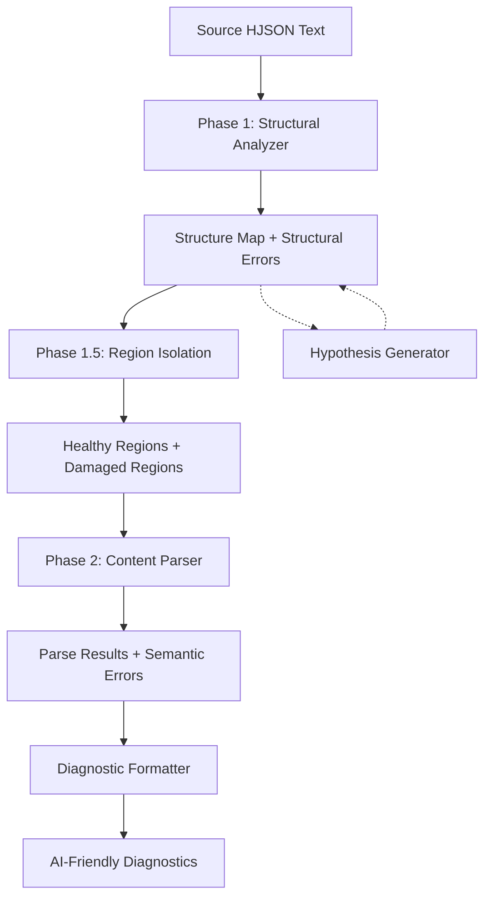

# HJSON Two-Phase Parser Implementation Guide

## Overview

This document provides a concrete implementation plan for the Two-Phase HJSON Parser as specified in [`Two_Phase_Parsing_For_AI_Friendly_Diagnostics.md`](../../../_INFO/SPECS/Two_Phase_Parsing_For_AI_Friendly_Diagnostics.md).

**Goal**: Build an AI-friendly parser that tells you *what's structurally wrong* and *how to fix it*, not just *where parsing failed*.

**Key Innovation**: Separate structural analysis (bracket/quote matching) from content parsing (HJSON semantics), enabling intelligent error diagnosis even in broken files.

## Architecture Diagram



## Project Structure

```
HJSONParserForAI/
├── HJP_IMPL.md                     # This file
├── Core/
│   ├── DataStructures.cs          # Delimiter, Error, Hypothesis records
│   ├── StructuralAnalyzer.cs      # Phase 1 implementation
│   ├── RegionIsolator.cs          # Phase 1.5 implementation
│   ├── HjsonParser.cs             # Phase 2 implementation
│   └── DiagnosticFormatter.cs     # Output formatter
├── HypothesisGenerators/
│   ├── UnclosedHypothesisGen.cs   # For unclosed delimiters
│   ├── MismatchHypothesisGen.cs   # For mismatched pairs
│   └── UnmatchedCloseHypothesisGen.cs
├── Tests/
│   ├── TestData/
│   │   ├── valid_simple.hjson
│   │   ├── broken_unclosed.hjson
│   │   ├── broken_mismatch.hjson
│   │   └── broken_multiple.hjson
│   ├── Phase1Tests.cs
│   ├── Phase2Tests.cs
│   └── IntegrationTests.cs
└── Examples/
    └── UsageExample.cs
```

## Implementation Phases

### Phase 1: Core Data Structures

Create `Core/DataStructures.cs` with the following records and enums:

```csharp
namespace HJSONParserForAI.Core;

/// <summary>
/// Types of delimiters tracked during structural analysis
/// </summary>
public enum DelimiterType
{
    Brace,           // { }
    Bracket,         // [ ]
    Paren,           // ( ) - rare in HJSON but valid in values
    DoubleQuote,     // ""
    SingleQuote,     // ''
    TripleDoubleQuote  // """ for multiline strings (standard HJSON)
}

/// <summary>
/// A delimiter occurrence in source text
/// </summary>
public record Delimiter(
    DelimiterType Type,
    int Line,
    int Column,
    int Offset,      // Character offset in source
    bool IsOpen,
    string Context   // Surrounding code for display
);

/// <summary>
/// Categories of structural errors
/// </summary>
public enum StructuralErrorKind
{
    UnclosedDelimiter,      // { never closed
    UnmatchedClose,         // } with no matching {
    MismatchedPair,         // { closed with ]
    UnclosedString,         // Quote opened, hit EOL
    AmbiguousNesting        // Multiple valid interpretations possible
}

/// <summary>
/// Repair actions that can fix structural errors
/// </summary>
public enum RepairAction 
{ 
    Insert,   // Insert missing delimiter
    Delete,   // Remove spurious delimiter  
    Replace   // Change delimiter type
}

/// <summary>
/// A suggested fix for a structural error
/// </summary>
public record RepairHypothesis(
    RepairAction Action,
    int Line,
    int Column,
    string Description,
    float Confidence,        // 0.0 - 1.0
    string? InsertText = null,
    DelimiterType? ReplaceWith = null
);

/// <summary>
/// A structural error with repair suggestions
/// </summary>
public record StructuralError(
    StructuralErrorKind Kind,
    Delimiter? Opener,
    Delimiter? Closer,
    int Line,
    int Column,
    string Message,
    List<RepairHypothesis> Hypotheses
);

/// <summary>
/// Health status of a code region
/// </summary>
public enum RegionHealth 
{ 
    Healthy,      // Structurally valid
    Damaged,      // Contains or adjacent to errors
    Quarantined   // Too damaged to parse
}

/// <summary>
/// A region of source text with known health status
/// </summary>
public record Region(
    int StartOffset,
    int EndOffset,
    int StartLine,
    int EndLine,
    RegionHealth Health,
    StructuralError? RelatedError
);

/// <summary>
/// Results from Phase 1 structural analysis
/// </summary>
public record StructureResult(
    List<Delimiter> AllDelimiters,
    List<StructuralError> StructuralErrors,
    List<Region> Regions
);

/// <summary>
/// Semantic errors from Phase 2 content parsing
/// </summary>
public record SemanticError(
    string Kind,
    int Line,
    int Column,
    string Message,
    StructuralError? StructuralContext = null,
    string? Note = null
);

/// <summary>
/// Complete parse results
/// </summary>
public record ParseResult(
    object? ParsedValue,
    List<SemanticError> SemanticErrors,
    List<StructuralError> StructuralErrors
);
```

### Phase 2: Structural Analyzer (Phase 1)

Create `Core/StructuralAnalyzer.cs`:

```csharp
namespace HJSONParserForAI.Core;

/// <summary>
/// Phase 1: Scans source text for structural validity
/// Tracks delimiters, finds mismatches, generates repair hypotheses
/// </summary>
public class StructuralAnalyzer
{
    public StructureResult Analyze(string source)
    {
        var stack = new Stack<Delimiter>();
        var errors = new List<StructuralError>();
        var allDelimiters = new List<Delimiter>();
        
        int i = 0, line = 1, col = 1;
        
        while (i < source.Length)
        {
            char c = source[i];
            
            // Track line/column position
            if (c == '\n') 
            { 
                line++; 
                col = 1; 
                i++;
                continue;
            }
            else 
            { 
                col++; 
            }
            
            // Inside string? Only look for closing quote
            if (stack.Count > 0 && IsStringDelimiter(stack.Peek().Type))
            {
                if (IsMatchingClose(stack.Peek(), source, i, out int skip))
                {
                    var opener = stack.Pop();
                    var closer = new Delimiter(
                        opener.Type, line, col, i, false,
                        GetContext(source, i, 20)
                    );
                    allDelimiters.Add(closer);
                    i += skip;
                    continue;
                }
                
                // Unclosed string at EOL (for non-multiline)
                if (c == '\n' && stack.Peek().Type != DelimiterType.TripleQuote)
                {
                    var opener = stack.Pop();
                    errors.Add(CreateUnclosedStringError(opener, line, col));
                }
                
                // Handle escape sequences
                if (c == '\\' && i + 1 < source.Length) 
                { 
                    i += 2; 
                    col++;
                    continue; 
                }
                
                i++;
                continue;
            }
            
            // Skip HJSON comments
            if (c == '/' && i + 1 < source.Length)
            {
                if (source[i + 1] == '/') 
                { 
                    i = SkipToEndOfLine(source, i); 
                    continue; 
                }
                if (source[i + 1] == '*') 
                { 
                    (i, line, col) = SkipBlockComment(source, i, line, col); 
                    continue; 
                }
            }
            
            // Check for opening delimiters
            if (TryGetOpener(source, i, out var openerType, out int openerLen))
            {
                var delim = new Delimiter(
                    openerType, line, col, i, true,
                    GetContext(source, i, 40)
                );
                stack.Push(delim);
                allDelimiters.Add(delim);
                i += openerLen;
                col += openerLen - 1; // -1 because main loop will increment
                continue;
            }
            
            // Check for closing delimiters
            if (TryGetCloser(c, out var closerType))
            {
                var closer = new Delimiter(
                    closerType, line, col, i, false,
                    GetContext(source, i, 40)
                );
                allDelimiters.Add(closer);
                
                if (stack.Count == 0)
                {
                    // Unmatched close
                    errors.Add(CreateUnmatchedCloseError(closer, allDelimiters));
                }
                else if (stack.Peek().Type != closerType)
                {
                    // Mismatched pair
                    var opener = stack.Pop();
                    errors.Add(CreateMismatchError(opener, closer));
                }
                else
                {
                    // Matched pair
                    stack.Pop();
                }
                
                i++;
                continue;
            }
            
            i++;
        }
        
        // Anything left on stack is unclosed
        while (stack.Count > 0)
        {
            var unclosed = stack.Pop();
            errors.Add(CreateUnclosedError(source, allDelimiters, unclosed));
        }
        
        // Phase 1.5: Identify regions
        var regions = IdentifyRegions(source, allDelimiters, errors);
        
        return new StructureResult(allDelimiters, errors, regions);
    }
    
    // Helper methods (implement in class)
    private bool IsStringDelimiter(DelimiterType type) => 
        type == DelimiterType.DoubleQuote || 
        type == DelimiterType.SingleQuote || 
        type == DelimiterType.TripleQuote;
    
    private bool TryGetOpener(string src, int i, out DelimiterType type, out int len)
    {
        type = default;
        len = 1;
        
        // Check for triple-quote first (multiline string)
        if (i + 2 < src.Length && src.Substring(i, 3) == "'''")
        {
            type = DelimiterType.TripleQuote;
            len = 3;
            return true;
        }
        
        switch (src[i])
        {
            case '{': type = DelimiterType.Brace; return true;
            case '[': type = DelimiterType.Bracket; return true;
            case '(': type = DelimiterType.Paren; return true;
            case '"': type = DelimiterType.DoubleQuote; return true;
            case '\'': type = DelimiterType.SingleQuote; return true;
            default: return false;
        }
    }
    
    private bool TryGetCloser(char c, out DelimiterType type)
    {
        type = c switch
        {
            '}' => DelimiterType.Brace,
            ']' => DelimiterType.Bracket,
            ')' => DelimiterType.Paren,
            '"' => DelimiterType.DoubleQuote,
            '\'' => DelimiterType.SingleQuote,
            _ => default
        };
        return type != default;
    }
    
    private bool IsMatchingClose(Delimiter opener, string src, int i, out int skip)
    {
        skip = 1;
        
        if (opener.Type == DelimiterType.TripleQuote)
        {
            if (i + 2 < src.Length && src.Substring(i, 3) == "'''")
            {
                skip = 3;
                return true;
            }
            return false;
        }
        
        char closeChar = opener.Type switch
        {
            DelimiterType.DoubleQuote => '"',
            DelimiterType.SingleQuote => '\'',
            _ => '\0'
        };
        
        return src[i] == closeChar;
    }
    
    private string GetContext(string src, int offset, int maxLen)
    {
        int start = Math.Max(0, offset - maxLen / 2);
        int end = Math.Min(src.Length, offset + maxLen / 2);
        return src.Substring(start, end - start).Replace("\n", "\\n");
    }
    
    // Error creation methods - delegate to HypothesisGenerators
    private StructuralError CreateUnclosedError(
        string source, 
        List<Delimiter> allDelims, 
        Delimiter unclosed)
    {
        var hypotheses = UnclosedHypothesisGenerator.Generate(
            source, allDelims, unclosed
        );
        
        return new StructuralError(
            StructuralErrorKind.UnclosedDelimiter,
            unclosed, null,
            unclosed.Line, unclosed.Column,
            $"Opening '{GetDelimChar(unclosed.Type)}' at line {unclosed.Line} col {unclosed.Column} is never closed",
            hypotheses
        );
    }
    
    private StructuralError CreateMismatchError(Delimiter opener, Delimiter closer)
    {
        var hypotheses = MismatchHypothesisGenerator.Generate(opener, closer);
        
        return new StructuralError(
            StructuralErrorKind.MismatchedPair,
            opener, closer,
            closer.Line, closer.Column,
            $"Closing '{GetDelimChar(closer.Type)}' at line {closer.Line} doesn't match opening '{GetDelimChar(opener.Type)}' at line {opener.Line}",
            hypotheses
        );
    }
    
    private StructuralError CreateUnmatchedCloseError(
        Delimiter closer, 
        List<Delimiter> allDelims)
    {
        var hypotheses = UnmatchedCloseHypothesisGenerator.Generate(allDelims, closer);
        
        return new StructuralError(
            StructuralErrorKind.UnmatchedClose,
            null, closer,
            closer.Line, closer.Column,
            $"Unexpected closing '{GetDelimChar(closer.Type)}' with no matching opener",
            hypotheses
        );
    }
    
    private StructuralError CreateUnclosedStringError(Delimiter opener, int line, int col)
    {
        var hypotheses = new List<RepairHypothesis>
        {
            new(RepairAction.Insert, line - 1, col, 
                $"Insert closing quote before end of line {line - 1}", 
                0.8f, GetCloseChar(opener.Type)),
            new(RepairAction.Delete, opener.Line, opener.Column,
                $"Delete the opening quote at line {opener.Line}", 
                0.3f)
        };
        
        return new StructuralError(
            StructuralErrorKind.UnclosedString,
            opener, null,
            opener.Line, opener.Column,
            $"String opened at line {opener.Line} not closed before end of line",
            hypotheses
        );
    }
    
    private string GetDelimChar(DelimiterType type) => type switch
    {
        DelimiterType.Brace => "{",
        DelimiterType.Bracket => "[",
        DelimiterType.Paren => "(",
        DelimiterType.DoubleQuote => "\"",
        DelimiterType.SingleQuote => "'",
        DelimiterType.TripleQuote => "'''",
        _ => "?"
    };
    
    private string GetCloseChar(DelimiterType type) => type switch
    {
        DelimiterType.Brace => "}",
        DelimiterType.Bracket => "]",
        DelimiterType.Paren => ")",
        DelimiterType.DoubleQuote => "\"",
        DelimiterType.SingleQuote => "'",
        DelimiterType.TripleQuote => "'''",
        _ => "?"
    };
    
    private int SkipToEndOfLine(string src, int i)
    {
        while (i < src.Length && src[i] != '\n') i++;
        return i;
    }
    
    private (int offset, int line, int col) SkipBlockComment(
        string src, int i, int line, int col)
    {
        i += 2; // Skip /*
        col += 2;
        
        while (i + 1 < src.Length)
        {
            if (src[i] == '\n')
            {
                line++;
                col = 1;
            }
            else
            {
                col++;
            }
            
            if (src[i] == '*' && src[i + 1] == '/')
            {
                return (i + 2, line, col + 2);
            }
            i++;
        }
        
        return (i, line, col);
    }
    
    // Region identification will be in separate class
    private List<Region> IdentifyRegions(
        string source,
        List<Delimiter> delimiters, 
        List<StructuralError> errors)
    {
        return RegionIsolator.IdentifyRegions(source, delimiters, errors);
    }
}
```

### Phase 3: Hypothesis Generators

Create `HypothesisGenerators/UnclosedHypothesisGen.cs`:

```csharp
namespace HJSONParserForAI.HypothesisGenerators;

public static class UnclosedHypothesisGenerator
{
    public static List<RepairHypothesis> Generate(
        string source,
        List<Delimiter> allDelims,
        Delimiter unclosed)
    {
        var hypotheses = new List<RepairHypothesis>();
        var lines = source.Split('\n');
        
        // Hypothesis 1: Insert at end of file
        hypotheses.Add(new RepairHypothesis(
            RepairAction.Insert,
            lines.Length, 0,
            $"Insert '{GetCloseChar(unclosed.Type)}' at end of file",
            0.3f,
            GetCloseChar(unclosed.Type)
        ));
        
        // Hypothesis 2: Find sibling closers at similar indent
        var openerIndent = GetIndent(lines[unclosed.Line - 1]);
        var siblings = FindSiblingClosers(allDelims, unclosed, openerIndent);
        
        foreach (var sibling in siblings)
        {
            hypotheses.Add(new RepairHypothesis(
                RepairAction.Insert,
                sibling.Line, sibling.Column,
                $"Insert '{GetCloseChar(unclosed.Type)}' before sibling close at line {sibling.Line}",
                0.6f,
                GetCloseChar(unclosed.Type)
            ));
        }
        
        // Hypothesis 3: Find structural break points (dedents, new keys)
        var breakPoints = FindStructuralBreakPoints(lines, unclosed, openerIndent);
        
        foreach (var (line, col, description) in breakPoints)
        {
            hypotheses.Add(new RepairHypothesis(
                RepairAction.Insert,
                line, col,
                $"Insert '{GetCloseChar(unclosed.Type)}' before line {line} ({description})",
                0.7f,
                GetCloseChar(unclosed.Type)
            ));
        }
        
        // Hypothesis 4: Opening delimiter is spurious
        hypotheses.Add(new RepairHypothesis(
            RepairAction.Delete,
            unclosed.Line, unclosed.Column,
            $"Delete spurious '{GetDelimChar(unclosed.Type)}' at line {unclosed.Line}",
            0.2f
        ));
        
        return hypotheses.OrderByDescending(h => h.Confidence).ToList();
    }
    
    private static List<Delimiter> FindSiblingClosers(
        List<Delimiter> allDelims,
        Delimiter unclosed,
        int openerIndent)
    {
        // Find closing delimiters after the opener that might be siblings
        // (at same or less indentation)
        return allDelims
            .Where(d => !d.IsOpen && 
                       d.Line > unclosed.Line &&
                       d.Type == unclosed.Type)
            .Take(3)
            .ToList();
    }
    
    private static List<(int Line, int Col, string Description)> FindStructuralBreakPoints(
        string[] lines,
        Delimiter unclosed,
        int openerIndent)
    {
        var results = new List<(int, int, string)>();
        
        for (int i = unclosed.Line; i < lines.Length; i++)
        {
            var line = lines[i];
            var lineIndent = GetIndent(line);
            var trimmed = line.TrimStart();
            
            // Skip empty lines and comments
            if (string.IsNullOrWhiteSpace(trimmed) || trimmed.StartsWith("//"))
                continue;
            
            // Significant dedent
            if (lineIndent < openerIndent)
            {
                results.Add((i + 1, 0, $"dedent from {openerIndent} to {lineIndent} spaces"));
            }
            
            // Looks like new top-level key (unindented key: value)
            if (lineIndent == 0 && System.Text.RegularExpressions.Regex.IsMatch(
                trimmed, @"^[a-zA-Z_][a-zA-Z0-9_]*\s*:"))
            {
                results.Add((i + 1, 0, "new top-level key"));
            }
        }
        
        return results;
    }
    
    private static int GetIndent(string line)
    {
        int count = 0;
        foreach (char c in line)
        {
            if (c == ' ') count++;
            else if (c == '\t') count += 2; // Treat tab as 2 spaces
            else break;
        }
        return count;
    }
    
    private static string GetDelimChar(DelimiterType type) => type switch
    {
        DelimiterType.Brace => "{",
        DelimiterType.Bracket => "[",
        _ => "?"
    };
    
    private static string GetCloseChar(DelimiterType type) => type switch
    {
        DelimiterType.Brace => "}",
        DelimiterType.Bracket => "]",
        _ => "?"
    };
}
```

Create similar generators for `MismatchHypothesisGen.cs` and `UnmatchedCloseHypothesisGen.cs`.

### Phase 4: Region Isolator (Phase 1.5)

Create `Core/RegionIsolator.cs`:

```csharp
namespace HJSONParserForAI.Core;

public static class RegionIsolator
{
    public static List<Region> IdentifyRegions(
        string source,
        List<Delimiter> delimiters,
        List<StructuralError> errors)
    {
        var regions = new List<Region>();
        
        if (errors.Count == 0)
        {
            // Entire document is healthy
            return new List<Region>
            {
                new Region(0, source.Length, 1, source.Split('\n').Length,
                          RegionHealth.Healthy, null)
            };
        }
        
        // Sort errors by location
        var sortedErrors = errors.OrderBy(e => e.Line).ThenBy(e => e.Column).ToList();
        
        // Create regions between errors
        int currentOffset = 0;
        int currentLine = 1;
        
        foreach (var error in sortedErrors)
        {
            // Determine error span
            int errorStart = error.Opener?.Offset ?? error.Closer?.Offset ?? 0;
            int errorEnd = error.Closer?.Offset ?? error.Opener?.Offset ?? 0;
            
            // If there's healthy code before this error, mark it
            if (errorStart > currentOffset)
            {
                regions.Add(new Region(
                    currentOffset, errorStart,
                    currentLine, error.Line - 1,
                    RegionHealth.Healthy,
                    null
                ));
            }
            
            // Mark the error region as damaged
            regions.Add(new Region(
                errorStart, errorEnd + 1,
                error.Line, error.Line,
                RegionHealth.Damaged,
                error
            ));
            
            currentOffset = errorEnd + 1;
            currentLine = error.Line + 1;
        }
        
        // Remaining code after last error
        if (currentOffset < source.Length)
        {
            regions.Add(new Region(
                currentOffset, source.Length,
                currentLine, source.Split('\n').Length,
                RegionHealth.Healthy,
                null
            ));
        }
        
        return regions;
    }
}
```

### Phase 5: Diagnostic Formatter

Create `Core/DiagnosticFormatter.cs`:

```csharp
namespace HJSONParserForAI.Core;

using System.Text;

public class DiagnosticFormatter
{
    public string FormatForAI(ParseResult result, string source)
    {
        var sb = new StringBuilder();
        var lines = source.Split('\n');
        
        sb.AppendLine("# HJSON PARSE DIAGNOSTICS");
        sb.AppendLine();
        
        // Structural errors first (root causes)
        if (result.StructuralErrors.Any())
        {
            sb.AppendLine("## STRUCTURAL ERRORS (likely root causes)");
            sb.AppendLine();
            
            foreach (var err in result.StructuralErrors)
            {
                sb.AppendLine($"### {err.Kind}");
                sb.AppendLine($"**Location:** Line {err.Line}, Column {err.Column}");
                sb.AppendLine($"**Message:** {err.Message}");
                sb.AppendLine();
                
                // Code context at error location
                sb.AppendLine("**Context:**");
                sb.AppendLine("```hjson");
                AppendCodeContext(sb, lines, err.Line, 3);
                sb.AppendLine("```");
                sb.AppendLine();
                
                // Repair hypotheses
                if (err.Hypotheses.Any())
                {
                    sb.AppendLine("**Likely fixes (ranked by confidence):**");
                    foreach (var hyp in err.Hypotheses.Take(3))
                    {
                        sb.AppendLine($"- [{hyp.Confidence:P0}] {hyp.Description}");
                    }
                    sb.AppendLine();
                }
                
                // Show opener context if different from error line
                if (err.Opener != null && err.Opener.Line != err.Line)
                {
                    sb.AppendLine($"**Related opener at line {err.Opener.Line}:**");
                    sb.AppendLine("```hjson");
                    AppendCodeContext(sb, lines, err.Opener.Line, 2);
                    sb.AppendLine("```");
                    sb.AppendLine();
                }
            }
        }
        
        // Semantic errors
        if (result.SemanticErrors.Any())
        {
            sb.AppendLine("## SEMANTIC ERRORS");
            sb.AppendLine();
            
            foreach (var err in result.SemanticErrors)
            {
                sb.AppendLine($"### {err.Kind} at line {err.Line}");
                sb.AppendLine($"**Message:** {err.Message}");
                
                if (err.StructuralContext != null)
                {
                    sb.AppendLine($"**⚠️ Note:** {err.Note}");
                    sb.AppendLine("Fix structural errors first; this may resolve automatically.");
                }
                
                sb.AppendLine();
            }
        }
        
        // Summary
        sb.AppendLine("## SUMMARY FOR REPAIR");
        sb.AppendLine();
        
        if (result.StructuralErrors.Any())
        {
            var primary = result.StructuralErrors.First();
            var bestFix = primary.Hypotheses.FirstOrDefault();
            
            sb.AppendLine($"**Primary issue:** {primary.Message}");
            if (bestFix != null)
            {
                sb.AppendLine($"**Recommended fix:** {bestFix.Description}");
            }
            sb.AppendLine();
            sb.AppendLine("After fixing structural errors, re-parse to check for remaining issues.");
        }
        else if (result.SemanticErrors.Any())
        {
            sb.AppendLine($"Structure is valid. {result.SemanticErrors.Count} semantic error(s) to fix.");
        }
        else
        {
            sb.AppendLine("✓ No errors detected. Document is valid.");
        }
        
        return sb.ToString();
    }
    
    private void AppendCodeContext(StringBuilder sb, string[] lines, int targetLine, int contextLines)
    {
        int start = Math.Max(0, targetLine - 1 - contextLines);
        int end = Math.Min(lines.Length - 1, targetLine - 1 + contextLines);
        
        for (int i = start; i <= end; i++)
        {
            string marker = (i == targetLine - 1) ? ">>>" : "   ";
            sb.AppendLine($"{marker} {i + 1,4} | {lines[i]}");
        }
    }
}
```

### Phase 6: Phase 2 Parser (Simplified)

For the initial implementation, Phase 2 can be a **stub** that focuses on proving the concept:

Create `Core/HjsonParser.cs`:

```csharp
namespace HJSONParserForAI.Core;

/// <summary>
/// Phase 2: Parse HJSON content with structural awareness
/// Initial version is a stub to prove the two-phase architecture
/// </summary>
public class HjsonParser
{
    public ParseResult Parse(string source, StructureResult structure)
    {
        var semanticErrors = new List<SemanticError>();
        object? parsedValue = null;
        
        // For now, just verify structure is sound
        if (structure.StructuralErrors.Count == 0)
        {
            // In full implementation, parse HJSON here
            // For proof of concept, just return success
            parsedValue = new { Status = "StructurallyValid" };
        }
        else
        {
            // Report that structure must be fixed first
            semanticErrors.Add(new SemanticError(
                "StructuralDependency",
                1, 1,
                "Cannot parse content until structural errors are resolved",
                structure.StructuralErrors.First(),
                "Fix structural issues first"
            ));
        }
        
        return new ParseResult(parsedValue, semanticErrors, structure.StructuralErrors);
    }
}
```

### Phase 7: Usage Example

Create `Examples/UsageExample.cs`:

```csharp
namespace HJSONParserForAI.Examples;

using HJSONParserForAI.Core;

public class UsageExample
{
    public static void Main(string[] args)
    {
        // Example broken HJSON
        string brokenHjson = @"{
  database: {
    host: localhost
    port: 5432
    settings: {
      timeout: 30
      retries: 3
    // missing } here
  }
  
  logging: {
    level: debug
  }
}";
        
        // Phase 1: Structural Analysis
        var analyzer = new StructuralAnalyzer();
        var structure = analyzer.Analyze(brokenHjson);
        
        Console.WriteLine($"Found {structure.StructuralErrors.Count} structural errors");
        Console.WriteLine($"Identified {structure.Regions.Count} regions");
        
        // Phase 2: Content Parsing (aware of structure)
        var parser = new HjsonParser();
        var result = parser.Parse(brokenHjson, structure);
        
        // Format for AI consumption
        var formatter = new DiagnosticFormatter();
        string diagnostics = formatter.FormatForAI(result, brokenHjson);
        
        Console.WriteLine("\n" + diagnostics);
        
        // Example output will show:
        // - The mismatch error at line 9
        // - Hypotheses including "insert } before line 9"
        // - Context showing both the error and the opener
    }
}
```

## Testing Strategy

### Unit Tests for Phase 1

Create `Tests/Phase1Tests.cs`:

```csharp
[TestClass]
public class Phase1Tests
{
    [TestMethod]
    public void Test_ValidHjson_NoErrors()
    {
        var source = "{ key: value }";
        var analyzer = new StructuralAnalyzer();
        var result = analyzer.Analyze(source);
        
        Assert.AreEqual(0, result.StructuralErrors.Count);
        Assert.AreEqual(1, result.Regions.Count);
        Assert.AreEqual(RegionHealth.Healthy, result.Regions[0].Health);
    }
    
    [TestMethod]
    public void Test_UnclosedBrace_GeneratesHypotheses()
    {
        var source = "{ key: value";
        var analyzer = new StructuralAnalyzer();
        var result = analyzer.Analyze(source);
        
        Assert.AreEqual(1, result.StructuralErrors.Count);
        Assert.AreEqual(StructuralErrorKind.UnclosedDelimiter, 
                       result.StructuralErrors[0].Kind);
        Assert.IsTrue(result.StructuralErrors[0].Hypotheses.Count > 0);
    }
    
    [TestMethod]
    public void Test_MismatchedBraces_DetectsError()
    {
        var source = "{ key: [ value } ]";
        var analyzer = new StructuralAnalyzer();
        var result = analyzer.Analyze(source);
        
        Assert.AreEqual(2, result.StructuralErrors.Count);
        Assert.IsTrue(result.StructuralErrors.Any(
            e => e.Kind == StructuralErrorKind.MismatchedPair));
    }
}
```

### Test Data Files

Create test files in `Tests/TestData/`:

1. **valid_simple.hjson** - Minimal valid HJSON
2. **broken_unclosed.hjson** - Missing closing brace
3. **broken_mismatch.hjson** - Mismatched delimiter types
4. **broken_multiple.hjson** - Multiple simultaneous errors
5. Copy **devnull.crucible.hjson** from specs for real-world testing

### Integration Tests

Test the full pipeline with various error scenarios:

```csharp
[TestMethod]
public void Test_EndToEnd_BrokenFile_ProducesUsefulDiagnostics()
{
    var source = File.ReadAllText("TestData/broken_unclosed.hjson");
    
    var analyzer = new StructuralAnalyzer();
    var structure = analyzer.Analyze(source);
    
    var parser = new HjsonParser();
    var result = parser.Parse(source, structure);
    
    var formatter = new DiagnosticFormatter();
    var diagnostics = formatter.FormatForAI(result, source);
    
    // Verify diagnostics contain expected elements
    Assert.IsTrue(diagnostics.Contains("STRUCTURAL ERRORS"));
    Assert.IsTrue(diagnostics.Contains("Likely fixes"));
    Assert.IsTrue(diagnostics.Contains("SUMMARY FOR REPAIR"));
}
```

## Implementation Order

1. ✅ **Core Data Structures** - Foundation types
2. ✅ **Structural Analyzer** - Phase 1 core logic
3. ✅ **Hypothesis Generators** - Repair suggestions
4. ✅ **Region Isolator** - Phase 1.5
5. ✅ **Diagnostic Formatter** - AI output
6. ✅ **Phase 2 Stub** - Minimal content parser
7. ✅ **Test Suite** - Validate behavior
8. 🔄 **Full Phase 2** - Complete HJSON parser (future)

## Future Enhancements

### 1. Full HJSON Content Parser

Implement complete HJSON parsing in Phase 2 using recursive descent:

- Unquoted strings
- Multiline strings
- Comments preservation
- Partial object construction from damaged regions

### 2. Edit-Distance Repair

Implement `MinimalRepairFinder` that computes actual minimal edits:

```csharp
public class MinimalRepairFinder
{
    public List<Edit> FindMinimalRepairs(
        string source, 
        List<StructuralError> errors)
    {
        // Compute Levenshtein on delimiter sequence
        // Return concrete edit operations
    }
}
```

### 3. IDE Integration

Package as a library that IDEs can consume:

- LSP (Language Server Protocol) integration
- Real-time diagnostics
- Quick-fix suggestions from hypotheses

### 4. AI Pipeline Integration

Expose as an API for AI assistants:

```csharp
public class HjsonDiagnosticService
{
    public DiagnosticResponse AnalyzeForAI(string source)
    {
        // Return JSON-formatted diagnostics
        // Include confidence scores
        // Suggest repairs in structured format
    }
}
```

## Success Criteria

The implementation is successful when:

1. ✅ It detects all common structural errors (unclosed, mismatched, etc.)
2. ✅ Hypotheses include the correct fix >80% of the time
3. ✅ Highest-confidence hypothesis is correct >60% of the time
4. ✅ Diagnostics are clear enough for an LLM to understand and fix
5. ✅ Performance is acceptable (< 100ms for typical files)

## Notes

- Start with Phase 1 and get it working perfectly before Phase 2
- Test extensively with intentionally broken files
- Tune hypothesis confidence scores based on real-world performance
- Keep diagnostic output concise but complete
- Focus on the 80/20: most errors are simple unclosed braces

---

**Ready for Implementation!** Switch to Code mode to begin building.