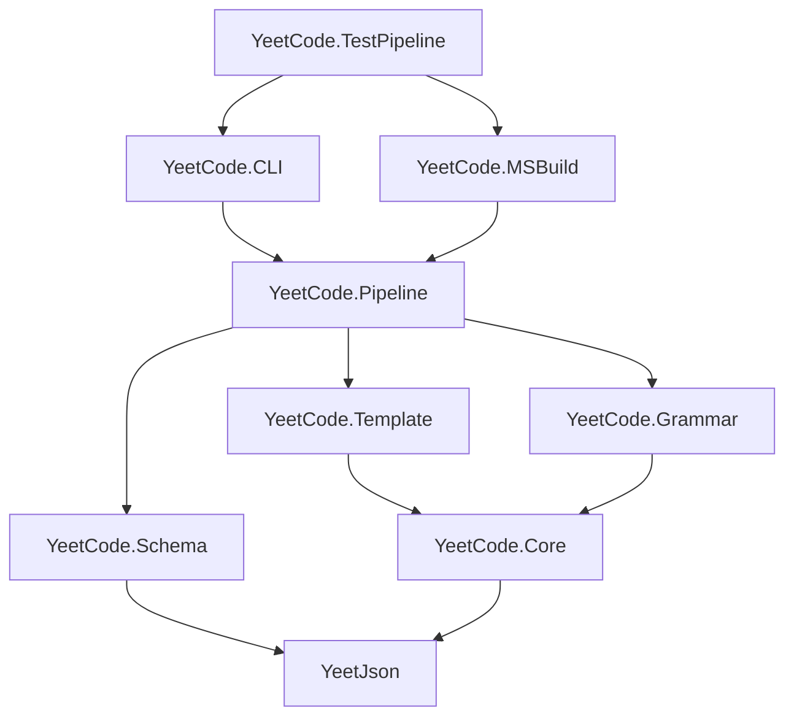

# YeetCode Project Structure

## Overview

YeetCode is a schema-driven meta-programming tool for language-to-language transformation.
It parses custom syntax into validated HJSON intermediate representation, then generates
multi-file output through templates with configurable delimiters.

**Implementation Language:** C# / .NET 10
**Current Scope:** HJSON Parser, Schema, Template, Grammar, CLI, MSBuild Task
**Test Target:** Protocol Buffers → C#

## Pipeline

```
                    schema.ytschema.ytson
                   /            \
                  /   validates   \
                 /                 \
grammar.ytgmr --> data.ytdata.hjson --> template.ytmpl --> output files
 (parse)          (validated)          (generate)          (N files)
```

## File Naming Convention

| Role | Extension | Example |
|------|-----------|---------|
| Grammar | `.ytgmr` | `proto.ytgmr` |
| Schema | `.ytschema.ytson` | `proto.ytschema.ytson` |
| Template | `.ytmpl` | `proto-csharp.ytmpl` |
| Data | `.ytdata.hjson` | `widgets.ytdata.hjson` |
| Input | `.ytinput.ext` | `widgets.ytinput.proto` |

The last extension always indicates the file format. The `yt` prefix identifies YeetCode-specific files.

## Solution Layout

```
AN_YeetCode/
├── _PROJECT_STRUCTURE.md              # This file
├── _SPECS/                            # Specification documents
│   ├── 00_IntroToYeetCode.md          # Introduction and overview
│   ├── 01_YeetCodeSpec.md             # Core spec: schema, grammar, template, CLI
│   ├── 05_YeetCode_ParserGenerator.md # Parser generator spec (future)
│   ├── 20_ProtoBuff_YeetCode.md       # Protobuf example
│   └── 30_Two_Phase_Parsing_For_AI_Friendly_Diagnostics.md
│
├── YeetJson.lib/                      # YeetJson Parser library
│   ├── YeetJson/
│   │   ├── Core/
│   │   │   ├── DataStructures.cs      # Delimiter, Error, Hypothesis, Region records
│   │   │   ├── StructuralAnalyzer.cs  # Phase 1: bracket/quote matching
│   │   │   ├── RegionIsolator.cs      # Phase 1.5: healthy vs damaged regions
│   │   │   ├── HjsonParser.cs         # Phase 2: content parsing → JsonDocument
│   │   │   └── DiagnosticFormatter.cs # AI-friendly error output
│   │   ├── HypothesisGenerators/
│   │   │   ├── UnclosedHypothesisGenerator.cs
│   │   │   ├── MismatchHypothesisGenerator.cs
│   │   │   └── UnmatchedCloseHypothesisGenerator.cs
│   │   └── YeetJson.csproj            # net10.0 library
│   └── YeetJson_Tests/
│       ├── SmokeTest.cs               # Key attributes + parsing tests
│       ├── TestHJsonFiles.cs           # Gold file test runner
│       └── TestData/                   # Test HJSON files + gold files
│
├── YeetCode.lib/                      # Main YeetCode library
│   ├── YeetCode/
│   │   ├── Core/                      # String case converter, JSON source gen
│   │   ├── Schema/                    # Schema loading and validation
│   │   │   ├── SchemaLoader.cs        # Parse .ytson → LoadedSchema
│   │   │   ├── SchemaTypes.cs         # Type definitions, field types
│   │   │   └── SchemaValidator.cs     # Validate data, fill defaults
│   │   ├── Template/                  # Template parsing and evaluation
│   │   │   ├── TemplateLexer.cs       # Custom delimiter tokenization
│   │   │   ├── TemplateParser.cs      # Directive → AST
│   │   │   ├── TemplateEvaluator.cs   # AST → output text
│   │   │   ├── ExpressionParser.cs    # Path, function, bracket expressions
│   │   │   └── TemplateTypes.cs       # AST node types
│   │   ├── Grammar/                   # PEG grammar parsing and interpretation
│   │   │   ├── GrammarLexer.cs        # Tokenize .ytgmr files
│   │   │   ├── GrammarParser.cs       # Token stream → ParsedGrammar AST
│   │   │   ├── GrammarTypes.cs        # Grammar AST types
│   │   │   ├── GrammarPreprocessor.cs # %define, %if/%else/%endif
│   │   │   └── PegInterpreter.cs      # Execute grammar → JsonDocument
│   │   ├── Pipeline/                  # Shared pipeline orchestration
│   │   │   └── YeetCodePipeline.cs    # Generate, Parse, Template, Validate
│   │   └── YeetCode.csproj            # net10.0 library
│   └── YeetCode_Tests/                # 50 unit + integration tests
│       ├── TestSchemaLoader.cs
│       ├── TestSchemaValidator.cs
│       ├── TestTemplateEngine.cs
│       ├── TestGrammarLexer.cs
│       ├── TestGrammarParser.cs
│       ├── TestPegInterpreter.cs
│       ├── TestGrammarPreprocessor.cs
│       ├── TestGrammarIntegration.cs
│       └── TestData/
│
├── YeetCode.CLI/                      # CLI executable
│   ├── Program.cs                     # Command dispatch: generate, parse, template, validate
│   └── YeetCode.CLI.csproj            # net10.0 exe, PackageId: ArtificialNecessity.YeetCode
│
├── YeetCode.MSBuild/                  # MSBuild task DLL (self-contained, out-of-process via TaskHostFactory)
│   ├── YeetCodeGenerateTask.cs        # Full yeet: grammar + input → template → output
│   ├── YeetCodeTemplateTask.cs        # Half yeet: data → template → output
│   ├── YeetCode.MSBuild.csproj        # net10.0 lib, PackageId: ArtificialNecessity.YeetCode.MSBuild
│   └── build/
│       └── ArtificialNecessity.YeetCode.MSBuild.targets  # UsingTask + TaskHostFactory
│
├── YeetCode.TestPipeline/             # End-to-end test project
│   ├── PipelineVerificationTests.cs   # xUnit tests verifying generated output
│   ├── YeetCode.TestPipeline.csproj   # MSBuild targets + Exec targets for both modes
│   └── TestData/
│       ├── HalfYeet/                  # Data + template → output
│       │   ├── greeting.ytdata.hjson
│       │   └── greeting.ytmpl
│       └── FullYeet/                  # Schema + grammar + input + template → output
│           ├── simple.ytschema.ytson
│           ├── simple.ytgmr
│           ├── simple.ytinput.proto
│           └── simple.ytmpl
│
├── version.jsonc                      # Version configuration for git-height versioning
├── YeetCode.shared.Build.props        # Shared build infrastructure
├── README.md                          # Project README
├── README-nuget.md                    # NuGet package README (how-to-use guide)
├── cmd/
│   └── publish-local.ps1              # Build + pack + deploy to local NuGet feed
│
└── AN_YeetCode.sln                    # Solution file
```

## Project Dependencies



## Two Usage Modes

### Half Yeet — Data + Template → Output

The simplest mode. Hand-written HJSON data runs through a template to produce output.

```
data.ytdata.hjson → template.ytmpl → output files
```

**CLI:** `yeetcode template --data d.hjson --template t.ytmpl --output out.txt`
**MSBuild:** `<YeetCodeTemplateTask DataFile="..." TemplateFile="..." OutputFile="..." />`

### Full Yeet — Grammar + Input → Data → Template → Output

The full pipeline. Parses custom syntax, validates against schema, generates output.

```
grammar.ytgmr + input.proto → data → template.ytmpl → output files
                                ↑
                        schema.ytschema.ytson
```

**CLI:** `yeetcode generate --schema s.ytson --grammar g.ytgmr --input i.proto --template t.ytmpl --output out.cs`
**MSBuild:** `<YeetCodeGenerateTask SchemaFile="..." GrammarFile="..." InputFile="..." TemplateFile="..." OutputFile="..." />`

## NuGet Packages

| Package | Type | Description |
|---------|------|-------------|
| `ArtificialNecessity.YeetCode` | dotnet tool | CLI executable (`yeetcode` command) |
| `ArtificialNecessity.YeetCode.MSBuild` | MSBuild task | Self-contained DLL with TaskHostFactory |

Both packages share the same `YeetCode.lib` library for pipeline logic.

## Test Strategy

- **YeetJson**: 4 tests — gold file tests + key attributes + parsing
- **YeetCode.lib**: 50 tests — schema, template, grammar lexer/parser/interpreter/preprocessor/integration
- **TestPipeline**: 6 tests — verify MSBuild task and CLI Exec produce identical output for both modes
- **Total**: 60 tests

## Key Design Decisions

1. **HJSON as the universal data format** — schema, data, functions all use HJSON
2. **Two-phase parsing everywhere** — structural analysis separate from content parsing
3. **JsonDocument output** — HJSON parser produces `System.Text.Json.JsonDocument`
4. **Schema-first validation** — data validated against schema before template sees it
5. **Custom delimiters** — template syntax adapts to output language, zero escaping
6. **Self-contained MSBuild task** — DLL calls YeetCode.lib directly, runs out-of-process via TaskHostFactory
7. **CLI + MSBuild parity** — both invoke the same `YeetCodePipeline` orchestrator
8. **File naming convention** — `.ytgmr`, `.ytmpl`, `.ytschema.ytson`, `.ytdata.hjson`, `.ytinput.ext`