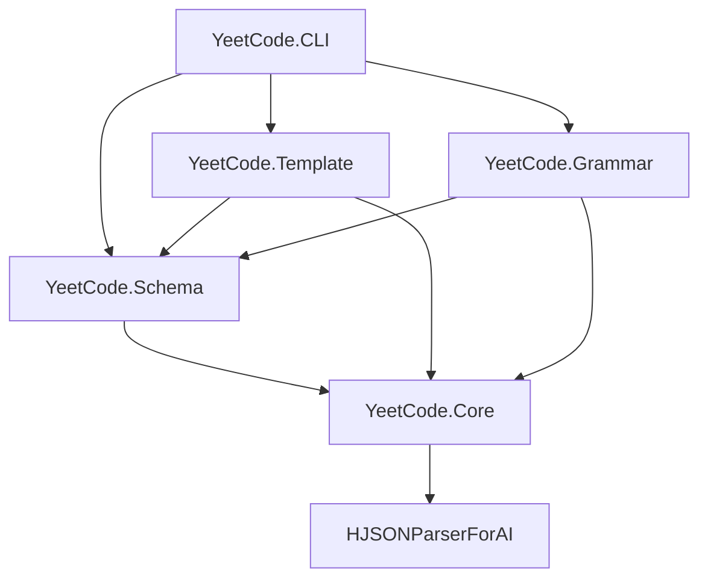

# YeetCode Project Structure

## Overview

YeetCode is a schema-driven meta-programming tool for language-to-language transformation.
It parses custom syntax into validated HJSON intermediate representation, then generates
multi-file output through templates with configurable delimiters.

**Implementation Language:** C# / .NET 10
**Current Scope:** Phases 1-3 (HJSON Parser, Schema, Template, Grammar, CLI — no Parser Generator)
**Test Target:** Crucible coordination language → C#

## Pipeline

```
                    schema.hjson
                   /            \
                  /   validates   \
                 /                 \
grammar.yeet --> data.hjson --> template.yt --> output files
 (parse)         (validated)     (generate)       (N files)
```

## Solution Layout

```
AN_YeetCode/
├── _PROJECT_STRUCTURE.md              # This file
├── _SPECS/                            # Specification documents
│   ├── 00_YeetCodeSpec.md             # Core spec: schema, grammar, template, CLI
│   ├── 05_YeetCode_ParserGenerator.md # Parser generator spec (future)
│   ├── 10_Crucible_V3_Yeetcode.md     # Crucible example: schema + grammar + template
│   ├── 20_ProtoBuff_YeetCode.md       # Protobuf example: schema + grammar + template
│   └── Two_Phase_Parsing_For_AI_Friendly_Diagnostics.md
│
├── HJSONParserForAI.lib/              # HJSON Parser library (existing, needs Phase 2)
│   ├── HJSONParserForAI/
│   │   ├── Core/
│   │   │   ├── DataStructures.cs      # Delimiter, Error, Hypothesis, Region records
│   │   │   ├── StructuralAnalyzer.cs  # Phase 1: bracket/quote matching
│   │   │   ├── RegionIsolator.cs      # Phase 1.5: healthy vs damaged regions
│   │   │   ├── HjsonParser.cs         # Phase 2: content parsing (STUB - needs impl)
│   │   │   └── DiagnosticFormatter.cs # AI-friendly error output
│   │   ├── HypothesisGenerators/
│   │   │   ├── UnclosedHypothesisGenerator.cs
│   │   │   ├── MismatchHypothesisGenerator.cs
│   │   │   └── UnmatchedCloseHypothesisGenerator.cs
│   │   └── HJSONParserForAI.csproj    # net10.0 library
│   └── HJSONParserForAI_Tests/
│       ├── TestHJsonFiles.cs          # Gold file test runner
│       └── TestData/                  # Test HJSON files + gold files
│
├── YeetCode.lib/                      # Main YeetCode library (structured like HJSONParserForAI.lib)
│   ├── YeetCode/                      # Library project
│   │   ├── Core/                      # Shared types, string utils, error types
│   │   ├── Schema/                    # Schema loading and validation
│   │   ├── Template/                  # Template parsing and evaluation
│   │   │   ├── StructuralAnalyzer.cs  # Two-phase: delimiter + block matching
│   │   │   ├── TemplateLexer.cs
│   │   │   ├── TemplateParser.cs
│   │   │   ├── TemplateEvaluator.cs
│   │   │   └── BuiltinFunctions.cs
│   │   ├── Grammar/                   # PEG grammar parsing and interpretation
│   │   │   ├── StructuralAnalyzer.cs  # Two-phase: delimiter + rule matching
│   │   │   ├── GrammarLexer.cs
│   │   │   ├── GrammarParser.cs
│   │   │   ├── PegInterpreter.cs
│   │   │   └── Preprocessor.cs
│   │   └── YeetCode.csproj           # net10.0 library
│   └── YeetCode_Tests/               # Test project (file-based, like HJSONParserForAI_Tests)
│       ├── TestSchemaLoader.cs
│       ├── TestTemplateEngine.cs
│       ├── TestGrammarParser.cs
│       └── TestData/
│
├── YeetCode.CLI/                      # CLI executable (separate project)
│   └── YeetCode.CLI.csproj
│
├── examples/                          # Example pipelines
│   └── crucible/                      # Crucible test case
│       ├── crucible.schema.hjson
│       ├── crucible.grammar.yeet
│       ├── crucible-csharp.yt
│       ├── test_simple.crucible       # Simple test input
│       └── expected/                  # Expected output for verification
│
└── YeetCode.sln                       # Solution file
```

## Project Dependencies



## Component Architecture

### 1. HJSONParserForAI (existing library, needs completion)

Two-phase parser with AI-friendly diagnostics:
- **Phase 1** (DONE): Structural analysis — bracket/quote matching, error detection, repair hypotheses
- **Phase 1.5** (DONE): Region isolation — healthy vs damaged regions
- **Phase 2** (STUB): Content parsing — recursive descent HJSON parser producing `JsonDocument`

**Output type: `System.Text.Json.JsonDocument`**

The parser converts HJSON into a standard JSON DOM (`JsonDocument`/`JsonElement`).
This enables automatic deserialization into strongly-typed C# shapes via
`JsonSerializer.Deserialize<T>()`. The HJSON parser uses `Utf8JsonWriter` internally
to build valid JSON from HJSON input, then wraps it in `JsonDocument.Parse()`.

Consumer pattern:
```csharp
// Parse HJSON → JsonDocument
var hjsonParser = new HjsonParser();
var result = hjsonParser.Parse(hjsonContent, structure);
var jsonDoc = result.ParsedDocument;

// Deserialize into strong C# types
var crucible = jsonDoc.Deserialize<CrucibleDefinition>();
```

HJSON features to support:
- Unquoted keys and string values
- Multiline strings with `"""`
- Comments: `//`, `/* */`, `#`
- Trailing commas
- Optional root braces

### 2. YeetCode.Core

Shared types used across all YeetCode components:
- `HjsonValue` type hierarchy (or re-export from HJSON parser)
- Path resolution utilities
- String case conversion functions (pascal, camel, snake, etc.)
- Error types and reporting

### 3. YeetCode.Schema

Schema loading and data validation:
- Parse `schema.hjson` into a type registry
- `@Type` definitions with fields, types, defaults, optionality
- Primitive types: string, int, float, bool
- Complex types: arrays `[T]`, maps `{T}`, type refs `@TypeName`
- Freeform objects `{}`
- Discriminated unions via `kind` field
- Recursive type support
- Schema validation: validate HJSON data against schema, fill defaults

### 4. YeetCode.Template

Template parsing and code generation:
- **Lexer**: Parse `<?yt delim="X Y" ?>` header, tokenize with custom delimiters
- **Parser**: Build AST from template directives
- **Evaluator**: Walk AST against validated data to produce output
- **Directives**: `#each`, `#if`/`#elif`/`#else`, `#define`/`#call`, `#output`
- **Expressions**: Dot access, bracket access, function calls
- **Built-ins**: upper, lower, pascal, camel, snake, length, index, first, last
- **Lookup tables**: Load from functions.hjson, bracket notation access
- **Multi-file output**: `#output` directive routing to named files
- **Compile-time validation**: Validate paths against schema, enforce `?.` for optionals

### 5. YeetCode.Grammar

PEG grammar parsing and interpretation:
- **Lexer**: Tokenize `.yeet` files
- **Parser**: Parse grammar rules, expressions, captures, type mappings
- **Preprocessor**: `%define`, `%if`/`%else`/`%endif` resolution
- **Interpreter**: Execute grammar against input text
- **PEG expressions**: Sequence, ordered choice, repetition, optional, grouping, named captures
- **Schema mapping**: `-> @Type`, `-> @Type { kind: @Variant }`, `-> path[]`, `-> path[key]`
- **Skip patterns**: `%skip` for whitespace/comment handling

### 6. YeetCode.CLI

Command-line interface:
- `yeetcode generate` — full pipeline: grammar + input → HJSON → template → output
- `yeetcode parse` — grammar + input → validated HJSON
- `yeetcode template` — HJSON data → template → output
- `yeetcode validate` — check HJSON data against schema
- `yeetcode check` — compile-time template validation against schema

## Implementation Phases

### Phase A: HJSON Parser Completion
1. Add HJSON value type system
2. Implement Phase 2 recursive descent parser
3. Fix multiline string delimiter (''' → """)
4. Write comprehensive tests
5. Regenerate gold files

### Phase B: Schema System
1. Create solution structure
2. Implement schema loader (parse schema.hjson → type registry)
3. Implement schema validator (validate data against schema, fill defaults)

### Phase C: Template Engine
1. Implement template lexer with custom delimiters
2. Implement template parser (directives → AST)
3. Implement built-in functions
4. Implement template evaluator
5. Implement multi-file output
6. Implement compile-time validation

### Phase D: Grammar Engine
1. Implement PEG grammar lexer
2. Implement PEG grammar parser
3. Implement grammar preprocessor
4. Implement PEG interpreter with schema mapping

### Phase E: CLI and Integration
1. Implement CLI with all commands
2. Create Crucible test artifacts (schema, grammar, template, input)
3. End-to-end testing

## Test Strategy

- **HJSON Parser**: Gold file tests (existing pattern) + unit tests for Phase 2
- **Schema**: Unit tests for type registry building and data validation
- **Template**: Unit tests for lexer/parser/evaluator + integration tests with example templates
- **Grammar**: Unit tests for PEG expressions + integration tests with Crucible grammar
- **E2E**: Crucible .crucible → .g.cs with expected output comparison

## Key Design Decisions

1. **HJSON as the universal data format** — schema, data, functions all use HJSON
2. **Two-phase parsing everywhere** — structural analysis separate from content parsing for better errors. Applied to HJSON, .yeet grammars, and .yt templates
3. **JsonDocument output** — HJSON parser produces `System.Text.Json.JsonDocument`, enabling `JsonSerializer.Deserialize<T>()` into strongly-typed C# shapes
4. **Schema-first validation** — data validated against schema before template sees it
5. **Custom delimiters** — template syntax adapts to output language, zero escaping
6. **Maps over arrays** — named collections use HJSON objects keyed by name
7. **Discriminated unions via kind field** — `kind: @TypeRef` with optional variant branches
8. **Compile-time template validation** — catch errors before runtime

## Future Work (not in current scope)

- **Comment preservation** — HJSON comments optionally parsed into preserved elements (e.g., special keys like `//comment_0`, `#comment_1`) that can be iterated like normal keys or ignored via a parse-time setting. This enables comment-aware tooling and round-trip editing.
- **JSON → HJSON output** — serialize JsonDocument/JsonElement back to human-friendly HJSON format with proper indentation and optional comment reinsertion
- **Format-preserving HJSON edit interface** — programmatically edit HJSON files while preserving original string formatting, indentation, comments, and whitespace. Round-trip editing without butchering the source. Depends on comment preservation.
- **Parser Generator** (spec 05) — generate standalone parsers from .yeet grammars for runtime use